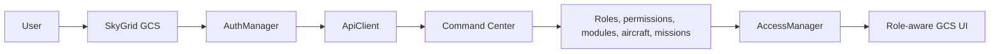
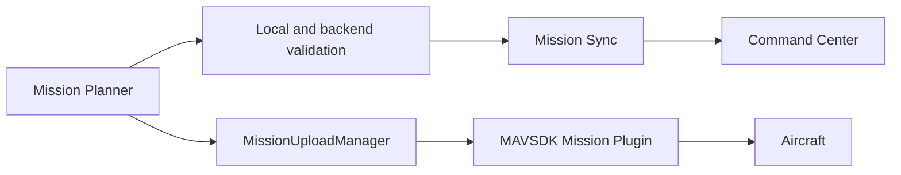
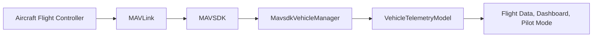
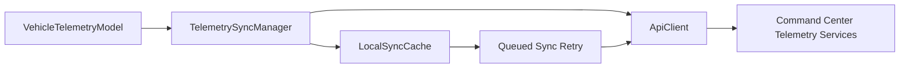
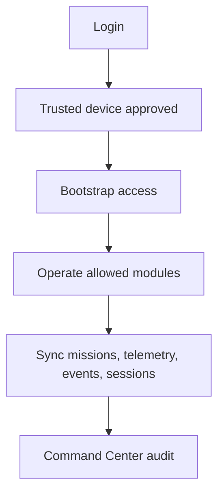
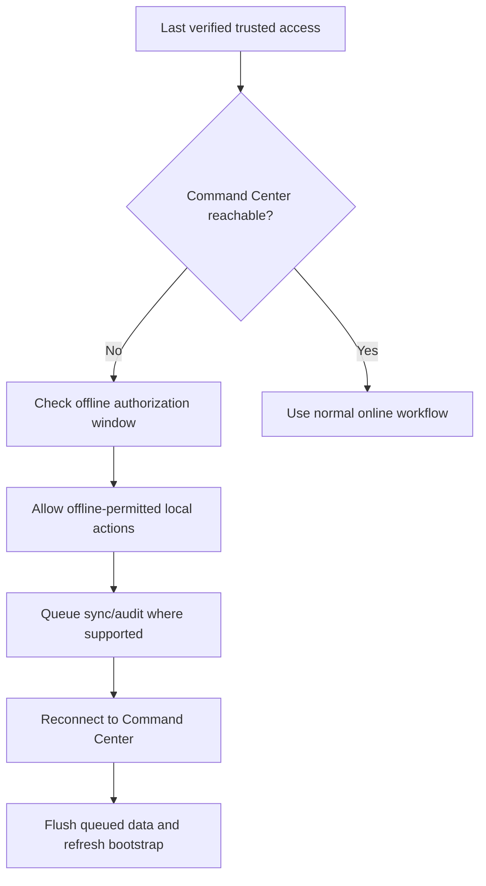

# SkyGrid GCS System Review and User Guide

Version: implementation-grounded system guide

Last reviewed: 2026-06-10

This guide explains the SkyGrid Ground Control Station (GCS), the way it interacts with SkyGrid Command Center, the user roles and permissions currently recognized by the GCS, the major workspaces, operational workflows, troubleshooting procedures, and developer-facing architecture.

The guide is written for new users, pilots, manufacturers, fleet operators, organization administrators, Command Center administrators, auditors, technical support personnel, and developers or integrators.

Important safety note: do not fly a real aircraft unless a qualified operator has inspected the aircraft, confirmed local regulations, checked the flight area, completed preflight checks, and approved the mission. Use simulation or bench testing first. For bench setup, remove propellers unless a qualified test lead has approved a controlled motor test area.

## Implementation Sources Used

This guide reflects the current GCS implementation where possible. Primary implementation sources include:

- `src/access/RoleAccessManager.*`
- `src/access/PermissionManager.*`
- `src/access/ModuleAccessManager.*`
- `src/security/AccessManager.*`
- `src/tools/GcsToolCatalogManager.*`
- `src/auth/AuthManager.*`
- `src/auth/SessionManager.*`
- `src/network/ApiClient.*`
- `src/sync/*`
- `src/vehicle/*`
- `src/manufacturer/*`
- `src/mission/*`
- `qml/app/Router.qml`
- `qml/screens/HomeScreen.qml`
- `qml/mission/MissionWorkspace.qml`
- `qml/tools/GcsToolsWorkspace.qml`
- `qml/manufacturer/ManufacturerWorkspaceScreen.qml`

Command Center remains the authoritative source of users, roles, permission scopes, trusted-device state, organization assignment, aircraft scope, mission scope, and audit records. The GCS enforces local checks for safety and user experience, but backend enforcement must remain authoritative.

## Table of Contents

1. System Overview
2. User Roles and Responsibilities
3. Workspace Guide
4. Operational Workflows
5. Permission Matrix
6. Aircraft Lifecycle
7. Data Flow Architecture
8. Troubleshooting Guide
9. Developer Guide
10. Interactive Help System
11. Quick Reference Checklists

## Part 1: System Overview

### What SkyGrid Is

SkyGrid is an enterprise UAV ecosystem. The current GCS is one application inside a larger operational platform.

The ecosystem consists of:

- SkyGrid Ground Control Station (GCS)
- SkyGrid Command Center (CC)
- Aircraft and flight controllers
- Pilots and operators
- Organizations
- Manufacturers
- Missions
- Telemetry services
- Audit services
- Fleet management services

The GCS is the local desktop application used to connect aircraft, configure vehicles, plan missions, monitor telemetry, operate Pilot Mode, run manufacturer workflows, record local events, and synchronize operational data with Command Center.

Command Center is the backend authority for accounts, organizations, trusted devices, role-based access control, mission synchronization, fleet assignments, vehicle profiles, telemetry ingestion, flight sessions, and audit review.

### GCS and Command Center Interaction

The GCS and Command Center interact through authenticated API calls and trusted-device headers.

At a high level:

1. The user signs in to Command Center from the GCS.
2. The GCS sends device identity data during login.
3. Command Center returns access and refresh tokens.
4. Command Center returns or requires trusted-device approval.
5. The GCS validates the session.
6. The GCS bootstraps the user's profile, roles, permissions, allowed modules, organization, assigned aircraft, missions, session state, and device summary.
7. The GCS enables only the workspaces and actions allowed by the bootstrap.
8. Mission, telemetry, event, and flight-session services synchronize online.
9. If Command Center is temporarily unavailable, the GCS may use the last verified trusted access snapshot for permitted offline workflows.

### Authentication

Authentication is handled by `AuthManager` and `ApiClient`.

Login uses:

- Email
- Password
- Device payload from `DeviceManager`
- `/api/auth/login/`

The GCS expects:

- Access token
- Refresh token
- Device status
- Optional device trust token

Access token refresh uses `/api/auth/refresh/`. A security failure such as a revoked device, disabled device, or force logout clears the local token state and blocks operations.

### Trusted Devices

SkyGrid uses trusted-device enforcement before mission operations are unlocked.

The GCS sends:

- `X-Device-UUID`
- `X-Device-Trust-Token`

Device approval is checked through `/api/devices/me/`. Pending devices can sign in but cannot perform protected operations until approved. A revoked or disabled device forces logout and clears access-controlled data.

### Authorization

Authorization is implemented in layers:

- `PermissionManager` exposes typed `can...` properties to QML.
- `ModuleAccessManager` derives visible workspaces/modules from allowed modules and permissions.
- `RoleAccessManager` normalizes implemented GCS role names.
- `AccessManager` maps sensitive actions to permission scopes, verifies trusted-session requirements, applies offline authorization rules, filters aircraft and mission data by local scope, and emits audit events for allowed or blocked actions.

Local authorization is intentionally conservative. If access is not loaded, an action is blocked. If the action requires a trusted session and the device is not trusted, the action is blocked. Some local setup actions may remain available offline only when the last verified trusted authorization is still valid.

### RBAC

RBAC means Role-Based Access Control. In SkyGrid, the user's role is not enough by itself. The GCS uses the combination of:

- Role names
- Permission scopes
- Allowed modules
- Trusted-device state
- Organization id
- Assigned aircraft ids
- Assigned mission ids

The GCS currently recognizes these normalized role groups:

- `SKYGRID_ADMIN`, with `SUPER_ADMIN` normalized to `SKYGRID_ADMIN`
- `ORGANIZATION_ADMIN`, with `OPERATIONS_ADMIN` normalized to `ORGANIZATION_ADMIN`
- `FLEET_MANAGER`
- `PILOT`
- `MANUFACTURER_ADMIN`
- `MANUFACTURER_ENGINEER`

Auditor, technical support, and developer/integrator access are currently best represented as permission profiles assigned by Command Center, not as hard-coded normalized roles in `RoleAccessManager`.

### Mission Synchronization

Mission synchronization is managed primarily by `MissionSyncManager`.

The GCS bootstraps from `/api/missions/sync/bootstrap/`, then applies the returned data to:

- Role access
- Permission access
- Module access
- Profile data
- Preferences
- Operator state
- Flight session state
- Vehicle profile access
- Local access cache

Mission save and validation require `can_plan_mission`. Mission upload requires `can_upload_mission`. Autonomous mission start requires `can_start_mission`.

### Telemetry Synchronization

Telemetry is received locally from aircraft through MAVLink/MAVSDK and synchronized through `TelemetrySyncManager` where permitted.

Telemetry streaming requires `can_stream_telemetry`. Flight telemetry and reports may also be visible through report/audit permissions depending on role and module assignment.

### Fleet Operations

Fleet operations are scoped by Command Center assignments and local access filtering. The GCS only shows or opens assigned aircraft and assigned missions when access scope is loaded.

Fleet workflows include:

- Viewing assigned aircraft
- Selecting active vehicles
- Viewing readiness and telemetry state
- Assigning aircraft and pilots where permission exists
- Reviewing mission history and reports
- Monitoring audit and operational status

## Part 2: User Roles and Responsibilities

### Current Role Model

Roles are normalized locally for UI state, but permissions and modules are the operational source of truth.

| Implemented Role Name | Alias | Purpose |
| --- | --- | --- |
| `SKYGRID_ADMIN` | `SUPER_ADMIN` | Command Center administrator or system administrator |
| `ORGANIZATION_ADMIN` | `OPERATIONS_ADMIN` | Organization administrator or operations administrator |
| `FLEET_MANAGER` | none | Fleet and aircraft assignment operator |
| `PILOT` | none | Flight operator |
| `MANUFACTURER_ADMIN` | none | Manufacturer administrator |
| `MANUFACTURER_ENGINEER` | none | Manufacturer engineering/operator role |

### Command Center Administrator

Implemented role: `SKYGRID_ADMIN` or `SUPER_ADMIN`

Purpose:
Administer global SkyGrid access, organizations, users, roles, trusted devices, manufacturers, and audits.

Responsibilities:

- Manage organizations
- Manage users
- Manage roles and permission scopes
- Manage manufacturers
- Approve or revoke trusted devices
- Monitor system activity
- Review audit records
- Investigate permission and session issues

Allowed actions, depending on assigned permissions:

- Manage organizations with `can_manage_organizations`
- Manage users with `can_manage_users`
- Manage roles with `can_manage_roles`
- Manage manufacturers with `can_manage_manufacturers`
- Approve devices with `can_approve_devices`
- Revoke devices with `can_revoke_devices`
- View reports with `can_view_reports`
- View vehicle audit with `can_view_vehicle_audit`
- View fleet data with `can_view_fleet`

Restricted actions:

- Cannot directly fly aircraft unless assigned pilot permissions such as `can_fly_manual`, `can_upload_mission`, and `can_start_mission`
- Cannot write vehicle parameters unless assigned vehicle configuration permissions
- Cannot bypass backend authorization from the GCS

Typical workflow:

1. Sign in from a trusted GCS device.
2. Review device and access state.
3. Inspect Command Center Sync status.
4. Review role and permission scopes.
5. Approve devices or resolve user access issues in Command Center.
6. Review audit events and reports.
7. Escalate operational issues to support or engineering.

### Organization Administrator

Implemented role: `ORGANIZATION_ADMIN` or `OPERATIONS_ADMIN`

Purpose:
Manage an organization's users, assigned aircraft, missions, reports, and operating access.

Responsibilities:

- Manage organization users
- Assign pilots
- Assign aircraft
- Manage missions
- View organization reports
- Monitor operational readiness
- Coordinate with fleet managers and pilots

Allowed actions, depending on assigned permissions:

- Assign aircraft with `can_assign_aircraft`
- Assign pilots with `can_assign_pilots`
- View fleet with `can_view_fleet`
- Plan missions with `can_plan_mission`
- View reports with `can_view_reports`
- View telemetry and logs where permitted
- Manage organization users and roles if granted `can_manage_users` or `can_manage_roles`

Restricted actions:

- Cannot configure manufacturer-controlled aircraft setup unless assigned vehicle configuration permissions
- Cannot fly manually unless assigned pilot permissions
- Cannot approve system-wide trusted devices unless assigned device approval permissions

Typical workflow:

1. Sign in from a trusted device.
2. Review dashboard readiness and fleet status.
3. Confirm pilots and aircraft assignments.
4. Review or create missions.
5. Monitor flight reports and telemetry summaries.
6. Review audit records for the organization.

### Fleet Manager

Implemented role: `FLEET_MANAGER`

Purpose:
Manage assigned fleet visibility, aircraft readiness, and mission/aircraft assignments without necessarily flying aircraft.

Responsibilities:

- Track fleet readiness
- View aircraft status
- Review assigned aircraft and mission history
- Coordinate pilot and aircraft assignment
- Monitor telemetry and mission state where permitted

Allowed actions, depending on assigned permissions:

- View fleet with `can_view_fleet`
- Assign aircraft with `can_assign_aircraft`
- Assign pilots with `can_assign_pilots`
- Manage multi-vehicle view with `can_manage_multi_vehicle`
- View reports and logs where permitted
- View telemetry where permitted

Restricted actions:

- Cannot start missions unless assigned `can_start_mission`
- Cannot manually fly unless assigned `can_fly_manual`
- Cannot modify aircraft production configuration unless assigned vehicle permissions

Typical workflow:

1. Open Dashboard.
2. Review fleet status and aircraft readiness.
3. Open Multi-Vehicle or Flight Data if permitted.
4. Confirm aircraft assignment and active vehicle status.
5. Coordinate with pilots or organization administrators.
6. Review reports after operations.

### Pilot

Implemented role: `PILOT`

Purpose:
Operate assigned aircraft and execute assigned missions.

Responsibilities:

- Review assigned aircraft
- Review assigned missions
- Connect aircraft
- Verify telemetry
- Execute missions
- Use Pilot Mode only when authorized
- Record and synchronize flight sessions and pilot actions

Allowed actions, depending on assigned permissions:

- View assigned aircraft with `can_view_fleet`
- View telemetry with `can_view_telemetry`
- Stream telemetry with `can_stream_telemetry`
- Plan or edit missions with `can_plan_mission`
- Upload missions with `can_upload_mission`
- Start missions with `can_start_mission`
- Use manual controls with `can_fly_manual`
- View logs and reports where permitted

Restricted actions:

- Cannot modify system-wide settings
- Cannot manage users, roles, organizations, or manufacturers
- Cannot configure production vehicle profiles unless granted manufacturing or configuration permissions
- Cannot operate aircraft not assigned to the local access scope

Typical workflow:

1. Sign in from a trusted GCS device.
2. Review assigned aircraft and mission status.
3. Connect aircraft through serial, UDP, or TCP.
4. Verify heartbeat, telemetry, GPS, battery, and link quality.
5. Open or create the mission.
6. Run validation and preflight.
7. Upload and start the mission if permitted.
8. Monitor telemetry and mission progress.
9. Land, disarm, save logs, and sync events.

### Manufacturer Administrator

Implemented role: `MANUFACTURER_ADMIN`

Purpose:
Manage manufacturer aircraft profiles, production configuration, testing, release, and audit review.

Responsibilities:

- Create vehicle profiles
- Configure aircraft
- Bind flight controllers
- Configure RC and parameters
- Validate firmware packages
- Run test flight readiness workflows
- Release aircraft to organizations
- Review configuration audit

Allowed actions, depending on assigned permissions:

- Configure vehicle with `can_configure_vehicle`
- Register vehicles with `can_register_vehicle`
- Edit vehicle profiles with `can_edit_vehicle_profile`
- Bind flight controllers with `can_bind_flight_controller`
- Configure RC with `can_configure_rc`
- Read parameters with `can_read_vehicle_parameters`
- Write parameter snapshots to Command Center with `can_write_vehicle_parameters`
- Run manufacturer test flight with `can_run_manufacturer_test_flight`
- Use guarded manual test mode with `can_fly_manual_test`
- Release vehicles with `can_release_vehicle_to_organization`
- Flash firmware with `can_flash_firmware` where the adapter supports it
- View vehicle audit with `can_view_vehicle_audit`

Restricted actions:

- Cannot access organization missions unless assigned
- Cannot fly production missions unless assigned pilot permissions
- Cannot bypass trusted-device checks
- Cannot release aircraft without release permission

Typical workflow:

1. Open Manufacturer Workspace.
2. Create or select a vehicle profile.
3. Connect the flight controller.
4. Bind controller identity to the profile.
5. Configure airframe, firmware, RC, parameters, payload, and optional hardware.
6. Capture or save parameter snapshots.
7. Run readiness and test flight workflow.
8. Review audit state.
9. Release aircraft to the target organization.
10. Lock profile state when production is complete.

### Manufacturer Engineer

Implemented role: `MANUFACTURER_ENGINEER`

Purpose:
Perform technical setup and engineering validation for aircraft production.

Responsibilities:

- Configure and inspect aircraft
- Bind and test flight controllers
- Configure RC and parameter snapshots
- Run bench checks
- Perform manufacturer test flight preparation
- Validate firmware and setup readiness

Allowed actions, depending on assigned permissions:

- Most manufacturer technical actions assigned by Command Center
- `can_configure_vehicle`
- `can_bind_flight_controller`
- `can_configure_rc`
- `can_read_vehicle_parameters`
- `can_write_vehicle_parameters`
- `can_run_manufacturer_test_flight`
- `can_fly_manual_test`
- `can_flash_firmware`, if firmware work is authorized

Restricted actions:

- May not manage manufacturer users or organizations unless granted administrative permissions
- May not release aircraft unless granted `can_release_vehicle_to_organization`
- May not access customer missions unless assigned

Typical workflow:

1. Open Manufacturer Workspace or GCS Tools.
2. Connect the flight controller.
3. Detect board and autopilot metadata.
4. Configure setup groups.
5. Validate RC and parameter state.
6. Run test readiness.
7. Hand off to a manufacturer administrator for release if not authorized to release.

### Auditor

Current implementation status:
Auditor is not a hard-coded normalized role in `RoleAccessManager`. It should be modeled as a Command Center permission profile using report, telemetry, mission log, and audit permissions.

Purpose:
Review operational evidence without modifying aircraft, missions, users, or configuration.

Responsibilities:

- View audits
- View telemetry records
- View flight reports
- Review mission logs
- Confirm compliance with operating procedures

Allowed actions, depending on assigned permissions:

- View reports with `can_view_reports`
- View telemetry with `can_view_telemetry`
- View mission logs with `can_view_mission_logs`
- View logs with `can_view_logs`
- Download logs with `can_download_logs`, if allowed
- View vehicle audit with `can_view_vehicle_audit`

Restricted actions:

- Cannot modify aircraft configuration
- Cannot bind flight controllers
- Cannot upload or start missions
- Cannot fly manually
- Cannot manage users or roles unless explicitly assigned

Typical workflow:

1. Sign in from a trusted device.
2. Open Dashboard or Command Center Sync.
3. Review assigned aircraft, mission reports, logs, telemetry records, and audit events.
4. Export or record findings through approved reporting procedures.

### Technical Support

Current implementation status:
Technical support is a support persona, not a hard-coded role. Assign support personnel only the scopes needed for diagnosis.

Purpose:
Diagnose GCS, device trust, aircraft connection, telemetry, sync, firmware, and operational issues.

Responsibilities:

- Help users log in and trust devices
- Diagnose aircraft connection failures
- Inspect telemetry and logs
- Review sync queues and backend reachability
- Escalate product defects with evidence

Allowed actions, depending on assigned permissions:

- View reports/logs/audits
- Use flight data and diagnostics
- Use simulation
- Use advanced MAVLink only if explicitly authorized
- Use terminal or parameter override only under strict operational controls

Restricted actions:

- Should not fly aircraft unless qualified and assigned pilot permissions
- Should not change aircraft parameters unless explicitly authorized
- Should not manage users or roles unless acting as an administrator

Typical workflow:

1. Confirm user, role, device trust, and backend URL.
2. Inspect Command Center Sync.
3. Reproduce the issue in simulation or bench mode where possible.
4. Review logs, telemetry, audit events, and error state.
5. Document exact cause and next step.

### Developer or Integrator

Current implementation status:
Developer and integrator access is not a hard-coded GCS role. It is a persona that may receive simulation, advanced MAVLink, payload, API, or diagnostic permissions.

Purpose:
Build, test, integrate, and extend SkyGrid GCS and connected services.

Responsibilities:

- Understand architecture
- Add modules safely
- Respect RBAC and backend authorization
- Integrate MAVSDK, MAVLink, Command Center APIs, payloads, and telemetry services
- Maintain documentation and Help Center content

Allowed actions, depending on assigned permissions:

- Use simulation with `can_use_simulation`
- Use advanced MAVLink with `can_use_advanced_mavlink`
- Use terminal with `can_use_terminal`
- Configure payload with `can_configure_payload`
- View telemetry/logs/reports where assigned

Restricted actions:

- Cannot assume development access grants flight authority
- Cannot bypass trusted-device or RBAC enforcement
- Cannot operate live aircraft without assigned operational permissions

Typical workflow:

1. Run the GCS in a development build.
2. Use simulation or bench hardware.
3. Verify permissions and modules in Command Center bootstrap.
4. Test online and offline behavior.
5. Add documentation updates in this guide when adding workflows.

## Part 3: Workspace Guide

### Dashboard

Purpose:
The Dashboard is the main operational overview after login.

Displays:

- Mission readiness
- Aircraft status
- Connected vehicles
- Telemetry status
- Active sessions
- Synchronization state
- User profile and organization
- Mission history
- Quick actions
- Fleet and audit summaries, where permitted

Key implementation notes:

- `HomeScreen.qml` renders the dashboard.
- Access is filtered by module and permission state.
- Mission actions are visible only when mission permissions and modules are available.
- Manufacturer users may be redirected to manufacturer-focused workflows when those modules are the default workspace.

### Mission Planner

Purpose:
Create, validate, save, synchronize, upload, and start missions.

Supported mission types:

- PhotoMap
- Virtual Fence
- 3D Map Area
- 3D Map POI
- Waypoint Route
- Tower Inspection

Explains:

- Waypoints: route points used for waypoint missions and generated survey paths
- Geofences: safety boundary data used in advanced mission workflows
- POIs: points of interest used by 3D POI and inspection workflows
- Mission validation: local validation followed by backend validation where available
- Upload workflow: requires aircraft connection, preflight readiness, and `can_upload_mission`
- Mission synchronization: save and validation use `MissionSyncManager`

Important permissions:

- `can_plan_mission`
- `can_upload_mission`
- `can_start_mission`
- `can_stream_telemetry`

### Flight Data

Purpose:
Monitor live aircraft state.

Displays:

- Telemetry
- Battery
- GPS
- Flight mode
- Link quality
- Aircraft status
- RC state
- Vehicle messages
- HUD data

Important permissions:

- `can_use_flight_data`
- `can_stream_telemetry`
- `can_view_telemetry`

### Pilot Mode

Purpose:
Live aircraft control and flight monitoring for authorized pilots.

Typical controls:

- Arm/disarm
- Takeoff
- Hold
- Land
- Return to home
- Emergency stop, where supported and permitted
- Joystick or virtual joystick input
- Camera/video panels

Important permissions:

- `can_fly_manual`
- `can_stream_telemetry`
- `can_view_vehicle_audit`, for some audit views

Restrictions:
Pilot Mode is unavailable without manual flight permission and a trusted operational session.

### Manufacturer Workspace

Purpose:
Aircraft production, setup, test, release, and audit workflow.

Tools:

- Vehicle Profiles
- Flight Controller Binding
- RC Calibration
- Parameters
- Test Flights
- Manual Test Mode
- Release / Lock
- Firmware Manager

Explains:

- Vehicle profiles: model, serial, firmware, airframe, and organization scope
- Flight controller binding: connects a detected controller identity to a profile
- RC calibration: maps and validates manual control channels
- Parameters: captures or saves parameter snapshots
- Test flights: manufacturer readiness and test authorization
- Release process: releases configured aircraft to organizations
- Firmware manager: package selection, validation, and flashing where supported

### GCS Tools Workspace

Purpose:
Technical setup, flight data, payload, diagnostics, logs, simulation, and sync workspace.

Sections implemented by `GcsToolCatalogManager`:

- Workflow: Dashboard, Flight Data, Mission Planner, Multi-Vehicle
- Firmware: Install Firmware, Install Firmware Legacy
- Setup: Connect, Initial Setup, Parameters / Tuning, Flight Modes, RC / Radio, ESC, Servo, Battery, Failsafe, Airframe
- Optional Hardware: RTK/GPS Inject, SiK Radio, DroneCAN/UAVCAN, Joystick, PX4Flow, Bluetooth Setup, Antenna Tracker
- Payload: Camera, Gimbal, RTSP/H264 Video, Geotagging, Mapping Overlap
- Advanced: MAVLink Inspector, Message Sender, Terminal, MAVFTP, Signing, Serial Passthrough, Board Info
- Analysis: Logs / Analysis, Simulation
- Manufacturer: Manufacturer Workspace, Command Center Sync

### Command Center Sync

Purpose:
Show session, RBAC, workspace, device trust, backend URL, event sync, mission sync, cached permissions, and production status.

Explains:

- Cached data
- Sync events
- Permission updates
- Session updates
- Trusted device state
- Offline authorization status

Key rule:
Background sync should not restart aircraft communication, telemetry streams, mission execution, or manual control.

### Logs / Analysis

Purpose:
Review onboard logs, local telemetry logs, warnings, graph data, and export placeholders.

Capabilities include:

- Log listing where supported
- Log download where supported
- TLog recording and replay
- Warning extraction
- Graphing
- KML and GPX export workflows

Important permissions:

- `can_view_logs`
- `can_download_logs`
- `can_view_mission_logs`
- `can_view_vehicle_audit`

### Simulation

Purpose:
Run or connect to simulated aircraft before using real hardware.

Explains:

- PX4 SITL
- ArduPilot SITL
- Gazebo endpoints
- UDP and TCP simulation endpoints
- Protocol test workflows

Important permission:

- `can_use_simulation`

### Help Center

Purpose:
Provide searchable in-app documentation generated from this guide.

Features:

- Searchable documentation
- Role-specific guides
- Quick start guides
- FAQ and troubleshooting
- Context help entry points
- First-time user walkthrough material

The Help Center should load this Markdown guide as its source instead of maintaining a second manual.

## Part 4: Operational Workflows

### First Login and Trusted Device Workflow

1. Open SkyGrid GCS.
2. Enter the Command Center email address.
3. Enter the password.
4. Select Sign In.
5. If the device is pending approval, contact a Command Center administrator.
6. After approval, select Check Approval.
7. Wait for session validation.
8. Wait for bootstrap to load roles, permissions, modules, organization, assigned aircraft, missions, and trusted-device state.
9. Confirm the Dashboard or assigned default workspace opens.

Validation:

- User is authenticated.
- Device is trusted.
- `sessionManager.operationsAllowed` is true.
- `accessManager.status` reports a verified access profile.

### Connecting an Aircraft

1. Open GCS Tools or Manufacturer Workspace.
2. Open Connect or Flight Controller.
3. Select Serial, UDP, or TCP.
4. For serial, click Refresh Ports.
5. Select COM port.
6. Select baud rate.
7. Select Connect.
8. Verify MAVLink heartbeat.
9. Verify detected system id and autopilot.
10. Verify telemetry.

Common baud rates:

- 115200
- 57600
- 921600

Validation:

- `vehicleManager.connected` is true.
- Connection URL is populated.
- Autopilot and health state are visible.
- Battery, GPS, link, and mode begin updating when telemetry is available.

### Mission Planning Workflow

1. Create Mission.
2. Select Mission Type.
3. Define route, polygon, takeoff point, POI, or virtual fence geometry.
4. Configure altitude, speed, camera, overlap, finish action, and advanced settings.
5. Validate mission locally.
6. Review weather and wind.
7. Save mission.
8. Sync mission to Command Center.
9. Connect aircraft.
10. Run preflight.
11. Upload mission.
12. Start mission.
13. Monitor progress.
14. End flight session and sync events.

Permission gates:

- Create/save/validate: `can_plan_mission`
- Upload: `can_upload_mission`
- Start: `can_start_mission`
- Telemetry: `can_stream_telemetry`

### Preflight and Mission Start Workflow

1. Confirm the correct aircraft is selected.
2. Confirm aircraft connection.
3. Confirm heartbeat.
4. Confirm GPS health.
5. Confirm battery health.
6. Confirm telemetry stream.
7. Confirm mission geometry.
8. Confirm takeoff point.
9. Confirm geofence/rally points if used.
10. Confirm weather and wind are acceptable.
11. Confirm permissions are available.
12. Upload mission.
13. Start mission only when all blockers are clear.

### Pilot Mode Workflow

1. Confirm pilot permission.
2. Confirm trusted device and active session.
3. Connect aircraft.
4. Confirm telemetry and link quality.
5. Open Pilot Mode.
6. Begin pilot session.
7. Use direct controls only when safe.
8. Record pilot actions.
9. Land and disarm.
10. End session and sync.

### Manufacturer Release Workflow

1. Create Vehicle Profile.
2. Configure Aircraft.
3. Bind Flight Controller.
4. Configure Parameters.
5. Calibrate RC.
6. Configure payload and optional hardware.
7. Validate firmware package or flash firmware where supported.
8. Run readiness checks.
9. Run Test Flight.
10. Review Results.
11. Review configuration audit.
12. Release Aircraft to organization.
13. Lock profile if final.

Permission gates:

- Profile create: `can_register_vehicle`
- Profile edit: `can_edit_vehicle_profile`
- Configure vehicle: `can_configure_vehicle`
- Bind controller: `can_bind_flight_controller`
- Configure RC: `can_configure_rc`
- Read/write parameters: `can_read_vehicle_parameters`, `can_write_vehicle_parameters`
- Test flight: `can_run_manufacturer_test_flight`
- Manual test: `can_fly_manual_test`
- Release: `can_release_vehicle_to_organization`

### Firmware Workflow

1. Open GCS Tools.
2. Select Install Firmware.
3. Select firmware package.
4. Validate package metadata.
5. Confirm target board and autopilot.
6. Connect or place controller in expected mode.
7. Start flash only if the adapter supports it.
8. Verify completion.
9. Reboot or reconnect controller.
10. Confirm board info and firmware version.

Permission gates:

- `can_flash_firmware`
- `can_configure_vehicle`, as a fallback in some manufacturer workflows

### Telemetry Sync Workflow

1. Connect aircraft.
2. Verify telemetry values are updating locally.
3. Confirm trusted session.
4. Confirm `can_stream_telemetry`.
5. Start or continue telemetry sync.
6. If offline, queue permitted telemetry records.
7. Sync pending data when Command Center returns.

### Offline Operation Workflow

1. Confirm the user previously had a verified trusted access profile.
2. Confirm offline authorization is still valid.
3. Use only actions that allow offline authorization.
4. Avoid starting new high-risk operations unless policy allows.
5. Queue audit or sync events where supported.
6. Reconnect to Command Center as soon as practical.
7. Validate session and flush sync queues.

Offline authorization currently expires after the configured local validity window in `AccessManager`.

## Part 5: Permission Matrix

Command Center is the source of truth for exact role-permission assignments. The "Typical Roles Allowed" column below describes the intended or common assignment based on implemented GCS behavior and workflow usage.

| Permission Name | Description | Typical Roles Allowed | Modules Affected |
| --- | --- | --- | --- |
| `can_plan_mission` | Create, edit, save, validate, and open mission plans | Pilot, Organization Admin, Fleet Manager, Manufacturer test users | Mission Planner, Dashboard, Advanced Mission Editor |
| `can_upload_mission` | Upload missions to connected aircraft | Pilot, Organization Admin | Mission Planner, MAVSDK mission upload |
| `can_start_mission` | Start autonomous missions | Pilot | Mission Planner, Flight Sessions |
| `can_fly_manual` | Use Pilot Mode and manual vehicle actions | Pilot | Pilot Mode, Manual Controls |
| `can_fly_manual_test` | Use manufacturer guarded manual test actions | Manufacturer Admin, Manufacturer Engineer | Manufacturer Manual Test |
| `can_run_manufacturer_test_flight` | Run manufacturer test flight workflow | Manufacturer Admin, Manufacturer Engineer | Manufacturer Test Flight, Preflight |
| `can_stream_telemetry` | Stream live telemetry and upload telemetry records | Pilot, Fleet Manager, Organization Admin, Support | Flight Data, Telemetry Sync, Connect |
| `can_view_telemetry` | View telemetry records | Pilot, Fleet Manager, Auditor, Support | Flight Data, Reports |
| `can_use_flight_data` | Open flight-data tools | Pilot, Fleet Manager, Support | GCS Tools, Flight Data |
| `can_view_fleet` | View aircraft/fleet records in scope | Pilot, Fleet Manager, Organization Admin, Auditor | Dashboard, Fleet, Vehicle Profiles |
| `can_assign_aircraft` | Assign aircraft to users or operations | Organization Admin, Fleet Manager | Fleet, Administration |
| `can_assign_pilots` | Assign pilots to aircraft or missions | Organization Admin, Fleet Manager | Fleet, Dashboard |
| `can_manage_multi_vehicle` | Use multi-vehicle management tooling | Fleet Manager, Organization Admin, Support | Multi-Vehicle |
| `can_view_mission_logs` | View mission logs | Pilot, Fleet Manager, Auditor, Support | Logs, Reports |
| `can_view_logs` | View logs/analysis workspace | Auditor, Support, Pilot, Fleet Manager | Logs / Analysis |
| `can_download_logs` | Download logs | Auditor, Support, Manufacturer Engineer | Logs / Analysis |
| `can_view_reports` | View reports and dashboard settings/report panels | Admin, Organization Admin, Fleet Manager, Auditor | Reports, Command Center Sync |
| `can_view_vehicle_audit` | View vehicle configuration and operational audit | Admin, Manufacturer Admin, Auditor, Support | Audit, Logs, Manufacturer Release |
| `can_approve_devices` | Approve trusted devices | Command Center Admin | Command Center device administration |
| `can_revoke_devices` | Revoke trusted devices | Command Center Admin | Command Center device administration |
| `can_manage_users` | Manage users | Command Center Admin, Organization Admin | Administration |
| `can_manage_roles` | Manage roles and permissions | Command Center Admin, Organization Admin where delegated | Administration |
| `can_manage_manufacturers` | Manage manufacturer records | Command Center Admin | Administration, Manufacturer Audit |
| `can_manage_organizations` | Manage organization records | Command Center Admin | Administration |
| `can_configure_vehicle` | Access vehicle configuration/manufacturer setup | Manufacturer Admin, Manufacturer Engineer | Manufacturer Workspace, Vehicle Configuration |
| `can_register_vehicle` | Create/register aircraft profiles | Manufacturer Admin | Vehicle Profiles |
| `can_edit_vehicle_profile` | Edit existing aircraft profiles | Manufacturer Admin, Manufacturer Engineer | Vehicle Profiles, Release/Lock |
| `can_bind_flight_controller` | Bind flight controller identity to vehicle profile | Manufacturer Admin, Manufacturer Engineer | Flight Controller Binding, Connect |
| `can_configure_rc` | Configure RC mapping and calibration data | Manufacturer Admin, Manufacturer Engineer | RC Mapping, Initial Setup |
| `can_read_vehicle_parameters` | Read or capture parameter snapshots | Manufacturer Admin, Manufacturer Engineer, Support | Parameters, Vehicle Configuration |
| `can_write_vehicle_parameters` | Save/write parameter snapshots or parameter updates where supported | Manufacturer Admin, Manufacturer Engineer | Parameters, Tuning |
| `can_release_vehicle_to_organization` | Release aircraft to an organization | Manufacturer Admin | Release / Lock |
| `can_run_initial_setup` | Use initial setup tools | Manufacturer Admin, Manufacturer Engineer, Support | Initial Setup, Setup Bench |
| `can_tune_vehicle` | Use tuning and parameter tools | Manufacturer Admin, Manufacturer Engineer, Support | Parameters / Tuning |
| `can_flash_firmware` | Validate or flash firmware where supported | Manufacturer Admin, Manufacturer Engineer, Support | Firmware Manager |
| `can_use_simulation` | Use simulation tooling | Pilot, Support, Developer | Simulation |
| `can_use_advanced_mavlink` | Use advanced MAVLink tools | Support, Developer, Manufacturer Engineer | Advanced Tools |
| `can_configure_payload` | Configure payload camera/gimbal tools | Manufacturer Engineer, Support, Integrator | Payload |
| `can_configure_optional_hardware` | Configure optional hardware tools | Manufacturer Engineer, Support, Integrator | Optional Hardware |
| `can_view_video_stream` | View RTSP/H264 video stream | Pilot, Support, Payload Operator | Payload Video |
| `can_configure_video_payload` | Configure video/geotagging/mapping payload workflow | Manufacturer Engineer, Payload Integrator | Payload Video, Geotagging |
| `can_use_terminal` | Use SERIAL_CONTROL terminal where supported | Support, Developer, Manufacturer Engineer | Advanced Tools, Terminal |
| `can_override_parameter_safety` | Override parameter safety controls | Senior Support, Developer, Manufacturer Engineer | Advanced Tools, Parameters |

### Action-to-Permission Examples

| GCS Action | Permission Used |
| --- | --- |
| `mission_save` | `can_plan_mission` |
| `mission_validation` | `can_plan_mission` |
| `mission_upload` | `can_upload_mission` |
| `mission_start` | `can_start_mission` |
| `manual_flight` | `can_fly_manual` |
| `aircraft_connection` | `can_stream_telemetry` |
| `vehicle_configuration` | `can_configure_vehicle` |
| `vehicle_profile_setup` | `can_register_vehicle` or `can_edit_vehicle_profile` |
| `flight_controller_binding` | `can_bind_flight_controller` |
| `rc_mapping` | `can_configure_rc` |
| `vehicle_parameter_read` | `can_read_vehicle_parameters` |
| `vehicle_parameter_write` | `can_write_vehicle_parameters` |
| `vehicle_release_lock` | `can_release_vehicle_to_organization` |
| `firmware_flash` | `can_flash_firmware` |
| `logs_analysis` | `can_view_logs` |
| `command_center_sync` | `can_view_reports` |
| `security_audit` | `can_view_vehicle_audit` |

## Part 6: Aircraft Lifecycle

The complete aircraft journey through SkyGrid is:

Manufacturer -> Testing -> Release -> Organization Assignment -> Pilot Assignment -> Mission Planning -> Flight Operations -> Telemetry Collection -> Reporting -> Audit

### Lifecycle Stages

1. Manufacturer creates or selects a vehicle profile.
2. Manufacturer connects a flight controller.
3. Manufacturer binds the controller to the vehicle profile.
4. Manufacturer configures firmware, airframe, RC, parameters, payload, optional hardware, battery, and failsafe settings.
5. Manufacturer captures parameter snapshots and configuration audit records.
6. Manufacturer runs readiness and test flight workflows.
7. Manufacturer releases the aircraft to an organization.
8. Organization administrator or fleet manager assigns aircraft to pilots or operations.
9. Pilot or mission planner creates a mission.
10. GCS validates and synchronizes the mission.
11. Pilot connects aircraft and performs preflight.
12. Pilot uploads and starts mission if permitted.
13. GCS records telemetry, flight sessions, pilot actions, and events.
14. Command Center stores telemetry, reports, mission history, and audits.
15. Auditors or administrators review records.

### Lifecycle Governance

- Manufacturer roles control production setup and release.
- Organization roles control assignment and mission operations.
- Pilot roles control flight execution.
- Auditor/report profiles inspect records.
- Command Center administrators manage the global security and access model.

## Part 7: Data Flow Architecture

### User to GCS to Command Center

Explanation:
The user signs in through the GCS. Command Center authenticates the user and returns a trusted-device and RBAC bootstrap. The GCS applies access locally and exposes only allowed modules and actions.

### Mission to Sync to Aircraft

Explanation:
Missions are planned locally, validated, saved/synced to Command Center, and uploaded to connected aircraft through MAVSDK when permissions and preflight checks allow.

### Aircraft to MAVLink to MAVSDK to GCS

Explanation:
The flight controller sends MAVLink data through serial, UDP, or TCP. MAVSDK surfaces connection, mission, action, and telemetry APIs to GCS managers. The UI reads telemetry from the exposed models.

### GCS Telemetry Sync to Command Center

Explanation:
Telemetry can be uploaded online. If connectivity is unavailable and policy permits, data may queue locally and synchronize later.

### Online Workflow

### Offline Workflow

## Part 8: Troubleshooting Guide

### Cannot Login

Likely causes:

- Wrong email or password
- Command Center backend unavailable
- Backend URL misconfigured
- Network or firewall issue
- Account disabled or locked

Solutions:

1. Confirm email and password.
2. Confirm Command Center backend URL.
3. Check network connectivity.
4. Ask an administrator to verify account state.
5. Review login error message.

### Trusted Device Rejected or Pending

Likely causes:

- New GCS machine has not been approved
- Device was revoked
- Device trust token is missing or expired
- Command Center blocked the device due to policy

Solutions:

1. Ask a Command Center administrator to approve the device.
2. Select Check Approval after approval.
3. If revoked, sign out and request a new approval flow.
4. Confirm system time and backend reachability.

### No Permissions Visible

Likely causes:

- Bootstrap failed
- User has no permission scopes
- Allowed modules were not returned
- Device is not trusted
- Cached access was purged after access profile changed

Solutions:

1. Open Command Center Sync.
2. Check `accessManager.status`.
3. Validate session.
4. Ask admin to verify assigned role and permission scopes.
5. Sign out and sign in after role changes.

### Aircraft Not Connecting

Likely causes:

- Wrong COM port
- Wrong baud rate
- USB cable does not support data
- Another application has the port open
- Flight controller is not sending MAVLink
- UDP/TCP endpoint is wrong
- Role cannot perform connection action

Solutions:

1. Refresh ports.
2. Try common baud rates: 115200, 57600, 921600.
3. Change USB cable or USB port.
4. Close other GCS tools.
5. Check Windows Device Manager for the COM port.
6. Confirm the flight controller is powered and running MAVLink.
7. Confirm `can_stream_telemetry` or equivalent connection permission.

### No Telemetry

Likely causes:

- Aircraft connected but telemetry stream not active
- Autopilot not sending expected messages
- Link quality poor
- Permissions block telemetry streaming
- Telemetry sync is offline

Solutions:

1. Verify heartbeat.
2. Reconnect aircraft.
3. Check flight controller telemetry settings.
4. Check link quality and antennas.
5. Confirm `can_stream_telemetry`.
6. Open Flight Data and refresh snapshot.

### Mission Upload Failure

Likely causes:

- User lacks `can_upload_mission`
- Aircraft not connected
- Mission has no valid upload route
- Preflight checklist blocks upload
- Boundary-only mission cannot be uploaded as a route
- MAVSDK mission upload failed

Solutions:

1. Confirm role and permission.
2. Validate mission geometry.
3. Confirm aircraft connection.
4. Fix preflight blockers.
5. Retry upload after telemetry is stable.
6. Check advanced mission table if raw MAVLink upload is enabled.

### Mission Start Failure

Likely causes:

- User lacks `can_start_mission`
- Mission not uploaded
- Aircraft not ready
- GPS or battery blocks start
- Mission is boundary-only
- Autopilot rejected start command

Solutions:

1. Confirm `can_start_mission`.
2. Upload mission successfully first.
3. Review preflight status.
4. Confirm aircraft mode and arming state.
5. Review MAVSDK status message.

### Sync Failure

Likely causes:

- Command Center unavailable
- Trusted session expired
- Device revoked
- Backend API returned 401 or 403
- Local queue contains pending items

Solutions:

1. Open Command Center Sync.
2. Validate session.
3. Check backend URL.
4. Confirm device trust.
5. Wait for queued events to flush after reconnect.
6. If access profile changed, reload bootstrap.

### Firmware Upload Failure

Likely causes:

- User lacks `can_flash_firmware`
- Firmware package metadata invalid
- Wrong board target
- Bootloader mode unavailable
- Adapter does not support flashing
- Flight controller connection unstable

Solutions:

1. Confirm firmware permission.
2. Validate firmware package.
3. Confirm board and autopilot.
4. Reconnect in required bootloader mode.
5. Use supported adapter workflow.
6. Record error and escalate if flashing support is not implemented for the board.

### GPS Issues

Likely causes:

- No satellite lock
- Indoor bench environment
- GPS antenna issue
- RTK correction unavailable
- Autopilot not reporting GPS health

Solutions:

1. Move to an open-sky location for real GPS tests.
2. Inspect satellite count and fix type.
3. Check antenna connection.
4. Check RTK/GPS Inject tool where used.
5. Do not start real flight without acceptable GPS.

### Connection Loss

Likely causes:

- Weak telemetry link
- USB disconnect
- Aircraft out of range
- Network endpoint closed
- Autopilot rebooted

Solutions:

1. Do not start new commands.
2. Follow local lost-link operating procedure.
3. Attempt reconnect if safe.
4. Check failsafe configuration.
5. Review logs after recovery.

## Part 9: Developer Guide

### Application Architecture

SkyGrid GCS is a Qt/QML desktop application with C++ backend services exposed to QML as context properties.

Major layers:

- QML shell, router, workspaces, controls, and dashboards
- C++ application state and managers
- Access/RBAC services
- Command Center API clients
- MAVSDK vehicle integration
- Telemetry, mission, flight session, and event synchronization
- Local cache and secure storage
- Payload, hardware, simulation, logs, and firmware services

### Qt/QML Structure

Key QML entry points:

- `qml/Main.qml`
- `qml/app/AppShell.qml`
- `qml/app/Router.qml`
- `qml/screens/HomeScreen.qml`
- `qml/screens/MissionPlannerScreen.qml`
- `qml/mission/MissionWorkspace.qml`
- `qml/pilot/ManualFlightScreen.qml`
- `qml/tools/GcsToolsWorkspace.qml`
- `qml/manufacturer/ManufacturerWorkspaceScreen.qml`

`AppShell.qml` selects login, startup, telemetry bar, and router states.

`Router.qml` uses `appState.currentScreen` and `appState.operationalMode` to load:

- Home
- Mission Planner
- Pilot Mode
- Vehicle Configuration
- Manufacturer Test Flight
- Manufacturer Workspace
- GCS Tools
- Mission Selector modal
- Help Center

### C++ Backend Services

Important C++ managers:

- `AppState`: navigation, selected mission tool, current GCS tool, operational mode
- `AuthManager`: login, logout, device approval
- `SessionManager`: session validation and operation blocking
- `AccessManager`: local RBAC action authorization and access cache
- `RoleAccessManager`: role normalization
- `PermissionManager`: permission property exposure
- `ModuleAccessManager`: allowed module derivation
- `MissionSyncManager`: bootstrap, mission save, validation, and open
- `TelemetrySyncManager`: telemetry sync and queue behavior
- `GcsEventSyncManager`: event/audit queue and sync
- `FlightSessionSyncManager`: pilot/mission session start and end
- `MavsdkVehicleManager`: vehicle connection and MAVSDK system access
- `MissionUploadManager`: aircraft mission upload
- `MissionExecutionManager`: autonomous mission start/progress
- `VehicleConfigManager`: flight controller binding, parameter snapshots, RC config, release calls
- `ManufacturerVehicleManager`: manufacturer profile and release API workflow
- `GcsToolCatalogManager`: permission-aware tools catalog

### MAVSDK Integration

MAVSDK is used for:

- Flight controller discovery
- MAVLink connection through serial/UDP/TCP URLs
- Mission upload and start
- Vehicle actions
- Telemetry subscription
- Advanced mission and vehicle operations where implemented

The GCS should not pretend unsupported operations succeeded. When an adapter or autopilot capability is missing, show unsupported or blocked status.

### Command Center API Integration

Common API areas:

- `/api/auth/login/`
- `/api/auth/refresh/`
- `/api/devices/me/`
- `/api/missions/sync/bootstrap/`
- Mission save/validation/sync endpoints
- Telemetry endpoints
- Flight session endpoints
- GCS event/audit endpoints
- Vehicle profile and manufacturer endpoints
- Weather check endpoints

`ApiClient` adds authentication and trusted-device headers where requested. It retries once on 401 by refreshing the access token. Device security failures force logout.

### RBAC Implementation

When adding a protected action:

1. Add or reuse a permission scope.
2. Add QML visibility and enabled-state checks if the action is user-facing.
3. Add a C++ authorization check in the manager that performs the action.
4. Map the action in `AccessManager::permissionForAction`.
5. Add fallback permissions only if they are intentionally equivalent.
6. Decide whether the action requires a trusted session.
7. Decide whether offline authorization is allowed.
8. Record blocked or allowed audit events for sensitive actions.
9. Update this guide and Help Center content.

### Local Caching

`LocalSyncCache` stores access snapshots and sync queues. The access snapshot includes:

- Roles
- Permissions
- Allowed modules
- Organization id
- Session status
- Device summary
- Last verified time
- Access fingerprint
- Aircraft scope
- Mission scope

If the access fingerprint changes, access-controlled cached data may be purged to avoid stale need-to-know data exposure.

### Event System

`GcsEventSyncManager` records and syncs operational events. Sensitive RBAC decisions can emit:

- `authorization_allowed`
- `authorization_blocked`
- Access or cache purge events
- Mission and flight-session events
- Vehicle configuration events

Events should include enough context for audit review without exposing secrets.

### Telemetry Architecture

Telemetry flow:

1. Aircraft sends MAVLink.
2. MAVSDK receives telemetry.
3. `MavsdkVehicleManager` and related vehicle managers update `VehicleTelemetryModel`.
4. QML reads telemetry for Dashboard, Flight Data, Pilot Mode, and Mission Planner.
5. `TelemetrySyncManager` uploads or queues telemetry according to permission and session state.

### Adding a New Module

1. Add the C++ manager if backend or device logic is needed.
2. Add QML screens or panels.
3. Add QML files to `qt_add_qml_module`.
4. Add tool catalog entry if it belongs in GCS Tools.
5. Add module derivation in `ModuleAccessManager`.
6. Add action mapping in `AccessManager`.
7. Wire context property in `main.cpp`.
8. Add tests or focused manual validation.
9. Update this guide.

## Part 10: Interactive Help System

### Purpose

The built-in Help Center gives operators and administrators immediate guidance without maintaining separate documentation.

### Source of Truth

The Help Center should load:

- `docs/SkyGrid_GCS_User_Guide.md`

The same Markdown file should be shipped as an application resource. In development, the Help Center may load from the working tree. In packaged builds, it should fall back to the embedded resource.

### Features

Required features:

- Searchable documentation
- Role-specific guides
- Quick start guides
- FAQ and troubleshooting
- Context help
- First-time user walkthrough
- Tooltips for Help entry points

### Search Behavior

Search should:

- Search headings and body text
- Return title, level, category, and excerpt
- Open the matching section
- Work offline because the guide ships with the GCS

### Role-Specific Guides

The Help Center should expose fast access to:

- Command Center Administrator
- Organization Administrator
- Fleet Manager
- Pilot
- Manufacturer Administrator
- Manufacturer Engineer
- Auditor
- Technical Support
- Developer or Integrator

### Context Help

Context help should map current workspace/tool context to guide sections:

- Dashboard -> Dashboard
- Mission Planner -> Mission Planner
- Flight Data -> Flight Data
- Manufacturer Workspace -> Manufacturer Workspace
- Command Center Sync -> Command Center Sync
- Pilot Mode -> Pilot Mode
- Logs / Analysis -> Logs / Analysis
- Simulation -> Simulation

### First-Time User Walkthrough

The first-time user walkthrough should guide a user through:

1. Login and trusted-device approval.
2. Dashboard orientation.
3. Permission and workspace visibility.
4. Simulation-first training.
5. Aircraft connection on a safe bench.
6. Mission planning in simulation.
7. Preflight.
8. Logs, reports, and support escalation.

### Maintenance Rule

When adding or changing a workflow, update this guide first. The Help Center should consume the updated guide directly.

## Part 11: Quick Reference Checklists

### Beginner Login Checklist

- GCS installed.
- Backend URL configured.
- User has Command Center account.
- Device is approved.
- Role has required permissions.
- Dashboard or assigned workspace opens.

### Bench Setup Checklist

- Propellers removed.
- Aircraft powered safely.
- Flight controller connected by USB or network endpoint.
- Correct COM/UDP/TCP connection selected.
- Baud rate selected.
- MAVLink heartbeat received.
- Board and autopilot detected.
- Telemetry verified.
- RC, battery, failsafe, and payload reviewed.

### Manufacturer Release Checklist

- Aircraft profile exists.
- Model, serial, airframe, and firmware are correct.
- Flight controller is bound.
- Firmware package validated or flashed where supported.
- Parameters captured.
- RC mapping checked.
- Payload and optional hardware checked.
- Readiness checks pass.
- Test flight completed if required.
- Audit records reviewed.
- Aircraft released to correct organization.
- Profile locked if final.

### Mission Planning Checklist

- Correct mission type selected.
- Correct aircraft selected.
- Takeoff point set if required.
- Route, polygon, or POI valid.
- Altitude and speed reviewed.
- Finish action reviewed.
- Geofence and rally points reviewed if used.
- Payload actions reviewed.
- Weather and wind checked.
- Mission saved and synced.
- Preflight passed.

### Flight Start Checklist

- Area clear.
- Pilot and observer ready.
- Aircraft connected.
- GPS healthy.
- Battery safe.
- Link quality acceptable.
- Mission uploaded.
- Emergency action understood.
- Operator has permission to start.

### After Flight Checklist

- Land.
- Disarm.
- Confirm aircraft is safe.
- Save logs.
- Review warnings.
- Sync telemetry and events.
- Add operational notes if required.
- Review reports and audit records.

### Recommended Training Order

1. Read this guide.
2. Sign in and identify your role/workspace.
3. Learn the Dashboard.
4. Open Help Center.
5. Open GCS Tools without connecting hardware.
6. Connect simulation.
7. Observe Flight Data.
8. Create a simple mission in simulation.
9. Run preflight in simulation.
10. Upload and run a simulation mission.
11. Connect real hardware on a safe bench with propellers removed.
12. Move to real flight only under approved supervision.
